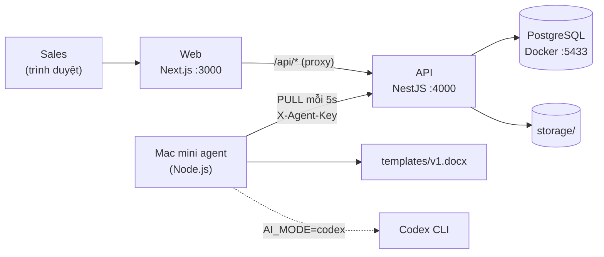

# An Bình Chemtech – Prototype tạo báo giá tự động

Prototype cho bài đánh giá **Fresher/Junior AI Automation & Application Engineer**.

Luồng chính: **Hệ thống quản lý nội bộ → Tạo báo giá → Gửi → Mac mini (agent) → Codex CLI / xử lý → Mẫu báo giá → File báo giá hoàn chỉnh (.docx)**



📘 **Solution Plan:** [docs/00-overview.md](docs/00-overview.md), gồm 12 tài liệu ngắn có sơ đồ (kiến trúc, data flow, vòng đời job, vai trò AI, rủi ro, bảo mật…).
📄 **File báo giá mẫu do prototype tạo ra:** [samples/BG-2026-0002.docx](samples/BG-2026-0002.docx)

---

## 1. Yêu cầu môi trường

| Công cụ | Phiên bản | Ghi chú |
|---|---|---|
| Node.js | ≥ 20 (đã test trên 24) | |
| npm | ≥ 10 | npm 11 tự đọc `allowScripts` trong `package.json` để cho phép install script của Prisma |
| Docker Desktop | bất kỳ | Chỉ để chạy PostgreSQL |

## 2. Cài đặt (một lần)

```bash
git clone https://github.com/luongthanhtung03/abctest.git
cd abctest

npm install                                  # cài toàn bộ workspace + build packages/shared
cp apps/api/.env.example apps/api/.env
cp apps/agent/.env.example apps/agent/.env

npm run db:up                                # PostgreSQL 16 trong Docker, cổng 5433
npm run db:migrate                           # tạo bảng
npm run db:seed                              # 3 tài khoản, 3 khách hàng, 6 sản phẩm
```

> Dùng cổng **5433** để không đụng PostgreSQL đã cài sẵn trên máy (thường chiếm cổng 5432).

## 3. Chạy demo (3 terminal)

```bash
npm run dev:api      # Terminal 1 – Backend API     http://localhost:4000
npm run dev:web      # Terminal 2 – Web UI          http://localhost:3000
npm run dev:agent    # Terminal 3 – "Mac mini" agent
```

Mở **http://localhost:3000**. Tài khoản demo có sẵn trên trang đăng nhập (mật khẩu `123456`):

| Tài khoản | Vai trò |
|---|---|
| `sales.a@anbinh.test` | Sales, chỉ thấy báo giá của mình |
| `sales.b@anbinh.test` | Sales, chỉ thấy báo giá của mình |
| `admin@anbinh.test` | Admin, thấy mọi báo giá |

## 4. Kịch bản demo

| # | Thao tác | Kết quả mong đợi |
|---|---|---|
| 1 | Đăng nhập `sales.a` → **Khách hàng** → chọn khách → **+ Tạo báo giá** | Form hiện, thông tin khách được điền sẵn |
| 2 | Chọn 2 sản phẩm (đơn giá tự lấy giá niêm yết), nhập số lượng, ghi chú viết tắt như `giá chưa gồm bx, giao trong giờ hc` → **Xem lại** → **Gửi** | Chuyển sang trang báo giá: *Chờ xử lý → Đang xử lý → Hoàn thành* (tự cập nhật mỗi 3 giây) |
| 3 | Bấm **Tải file báo giá (.docx)** | File Word điền đủ dữ liệu, số tiền bằng chữ, ghi chú đã được AI (mock) chuẩn hoá |
| 4 | Dừng agent (Ctrl+C ở Terminal 3), chờ khoảng 1 phút, tạo báo giá mới | Báo giá ở *Chờ xử lý* kèm cảnh báo **"Mac mini đang mất kết nối"** |
| 5 | Chạy lại `npm run dev:agent` | Agent tự nhận báo giá đang chờ, chuyển *Hoàn thành* |
| 6 | Nhập số lượng `0` hoặc bỏ trống điều kiện thanh toán → **Xem lại** | Báo lỗi ngay tại từng ô. Backend cũng từ chối với lỗi 400 theo từng trường |
| 7 | Đăng nhập `sales.b`, mở cùng khách hàng | **Không thấy** báo giá của `sales.a`. Mở thẳng URL báo giá hoặc URL file cũng nhận 404 |
| 8 | Đăng nhập `admin` | Thấy báo giá của mọi người |
| 9 | Chạy agent với lỗi giả lập: `SIMULATE_FAIL=1 npm run dev:agent` (PowerShell: `$env:SIMULATE_FAIL=1; npm run dev:agent`) rồi tạo báo giá | Timeline: thử 3 lần → **Lỗi** + lý do. Chạy lại agent bình thường, bấm **Thử lại** → *Hoàn thành* |

Chống gửi trùng (idempotency) khó thấy bằng tay vì nút "Gửi" bị khoá khi đang gửi. Có thể kiểm tra bằng API: gửi `POST /quotes` hai lần cùng header `Idempotency-Key`, lần 2 trả về **đúng báo giá cũ** (`"duplicate": true`) và không tạo báo giá mới.

## 5. Kiểm thử tự động

```bash
npm test     # 26 test: tính tiền, đọc số thành chữ, schema, render + kiểm tra DOCX, fallback của AI
```

## 6. Đã làm, chỉ thiết kế, giả lập

### ✅ Đã hoàn thành (Built)
- Luồng chính end-to-end: khách hàng → form → xem lại → gửi → xử lý nền → tải file DOCX tạo từ mẫu.
- **Mô hình pull**: agent hỏi việc mỗi 5 giây, **claim nguyên tử** bằng `FOR UPDATE SKIP LOCKED`.
- **Snapshot** đóng băng khi gửi. **Backend tự tính tổng tiền** (số nguyên VND), không tin số liệu từ client.
- 4 trạng thái `PENDING / PROCESSING / COMPLETED / FAILED`, **auto-retry 3 lần**, nút **Thử lại**, **timeline** sự kiện.
- **Idempotency key** chống gửi trùng (kể cả khi hai request đến cùng lúc).
- **Cảnh báo Mac mini offline** dựa trên `last_seen_at`.
- Validate bằng **một schema zod dùng chung** ở web, backend và agent.
- Kiểm tra file đầu ra trước khi upload (không còn placeholder, có số báo giá và tổng tiền).
- Đăng nhập (bcrypt + JWT trong cookie httpOnly), 2 vai trò, **kiểm tra quyền sở hữu** (kể cả tải file), **API key riêng cho agent**.
- Bước AI qua interface `AiAssistant`: mock và adapter Codex CLI, có **schema, timeout và fallback về văn bản gốc**.

### 🧪 Đang giả lập (Mocked) và cách thay thế

| Thành phần | Trong prototype | Khi vận hành thật |
|---|---|---|
| Mac mini | Tiến trình agent trên máy dev | Chạy cùng code trên Mac mini, `API_URL` trỏ tới server, chạy bằng launchd |
| Codex CLI | `AI_MODE=mock` (chuẩn hoá theo quy tắc) | Cài và đăng nhập Codex, đặt `AI_MODE=codex` (adapter `apps/agent/src/ai/codex-ai.ts` đã có sẵn, **chưa chạy thử với Codex thật**, cần kiểm tra flag theo `codex exec --help`) |
| File storage | `apps/api/storage/` | Thêm `S3FileStorage`, key tương đối giữ nguyên |
| Hệ thống quản lý nội bộ | Trang khách hàng tối giản + seed | Gắn nút "Tạo báo giá" vào trang khách hàng của hệ thống hiện có |
| Mẫu báo giá | `templates/v1.docx` được sinh bằng script (`npm run build-template -w @abc/agent`) | Nghiệp vụ tự soạn trong Word với cùng các placeholder |

### 📄 Chỉ thiết kế (Doc only), chưa triển khai
Huỷ / Sửa báo giá / Tạo bản sao · lease + heartbeat + sweep khi agent chết giữa chừng · nhiều phiên bản mẫu · log tải file · che PII và kiểm tra số trong bước AI · sandbox Codex · checksum sha256 · backoff theo thời gian · xuất PDF · SSO, HTTPS, IP allowlist, backup. Chi tiết và hướng xử lý ở [docs/11](docs/11-prototype-and-production.md).

## 7. Giả định chính
- File báo giá được **lưu lại và gắn với báo giá**, người dùng tải lại bất cứ lúc nào (xem [docs/01](docs/01-requirements-and-scope.md)).
- Web app và Mac mini có thể ở hai mạng khác nhau, nên agent **chủ động gọi ra** (pull).
- Xử lý **bất đồng bộ**, người dùng không phải chờ trên màn hình.
- Báo giá đã gửi **không sửa** (immutable). Muốn thay đổi thì tạo báo giá mới.
- Toàn bộ dữ liệu là giả lập.

## 8. Công cụ AI đã sử dụng
- **Claude Code** (Claude Opus): cùng phân tích đề bài, thảo luận và chốt thiết kế từng bước (yêu cầu → workflow → kiến trúc → data flow → vòng đời job → vai trò AI → rủi ro → bảo mật), sau đó hỗ trợ viết code, test và tài liệu. Mỗi bước là một commit riêng (xem `git log`).
- Mọi quyết định kiến trúc đều được thảo luận và kiểm chứng: chạy test, gọi API bằng curl, thử các kịch bản lỗi.

## 9. Nếu triển khai production
1. Gắn module vào hệ thống quản lý nội bộ hiện có.
2. HTTPS, SSO (Google Workspace / Microsoft 365), xoay vòng API key, giới hạn IP cho `/agent/*`.
3. Lease + heartbeat + sweep để tự phục hồi khi agent chết giữa chừng. Backoff khi retry.
4. S3/R2 private + signed URL. Backup DB và storage định kỳ.
5. Codex thật trong sandbox read-only, che PII, kiểm tra số liệu. Lưu lại kết quả AI để retry cho kết quả giống nhau.
6. Huỷ / sửa / tạo bản sao, nhiều phiên bản mẫu, xuất PDF.
7. Giám sát: cảnh báo khi agent offline quá N phút hoặc có job FAILED. Agent chạy như service launchd.

## 10. Cấu trúc repo

```
apps/
  web/        Next.js – giao diện (login, khách hàng, form báo giá, trang trạng thái)
  api/        NestJS + Prisma – auth, quotes, agent endpoints, storage
    prisma/   schema.prisma, migrations, seed.ts
  agent/      "Mac mini" agent – poll, pipeline, AI adapters, render DOCX
    templates/v1.docx
packages/
  shared/     zod schemas, computeTotals, đọc số thành chữ (dùng chung 3 app)
docs/         Solution Plan (00–11)
samples/      File báo giá mẫu do prototype tạo ra
```

## 11. Xử lý sự cố

| Triệu chứng | Cách xử lý |
|---|---|
| `Can't reach database server at localhost:5433` | Mở Docker Desktop rồi chạy `npm run db:up` |
| `Cannot find module '@abc/shared'` | Chạy `npm run build:shared` |
| Báo giá mãi ở *Chờ xử lý* | Kiểm tra Terminal 3 (agent) đang chạy và `AGENT_API_KEY` trong `apps/agent/.env` khớp với `apps/api/.env` |
