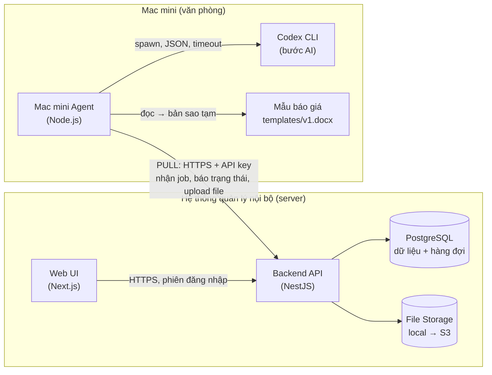

# 00 · Tổng quan giải pháp (Solution Plan)

> Prototype quy trình **tạo báo giá tự động**: Hệ thống quản lý nội bộ → Tạo báo giá → Mac mini → Codex CLI / tác vụ xử lý → Mẫu báo giá → File báo giá hoàn chỉnh.

## Mục đích

Tài liệu này là điểm vào của Solution Plan. Nó tóm tắt giải pháp trong một trang. Từng khía cạnh được trình bày chi tiết trong các file `01` → `11`.

## Sơ đồ tổng thể

## Giải pháp trong 6 ý

1. **Bất đồng bộ, có trạng thái.** Khi người dùng bấm "Gửi", hệ thống tạo ngay một báo giá ở trạng thái **Chờ xử lý**. Việc tạo file diễn ra ở nền. Trạng thái đi qua `Chờ xử lý → Đang xử lý → Hoàn thành / Lỗi` và hiển thị trên giao diện.
2. **Mac mini chủ động kéo việc (pull).** Mac mini hỏi backend vài giây một lần xem có job mới không. Mac mini không cần mở cổng vào hay có IP public. Khi Mac mini mất kết nối, job chỉ nằm chờ và không bị mất.
3. **PostgreSQL vừa lưu dữ liệu vừa làm hàng đợi.** Mỗi job được nhận nguyên tử bằng `FOR UPDATE SKIP LOCKED`. Ở quy mô SME, không cần thêm Redis/RabbitMQ.
4. **Snapshot tại thời điểm gửi.** Backend đóng băng thông tin khách hàng, sản phẩm, giá, tổng tiền và phiên bản mẫu vào payload. Cùng một snapshot luôn cho ra cùng một file.
5. **Code xác định làm phần cốt lõi, AI chỉ ở phần rìa.** Tính tiền, đọc số thành chữ và điền mẫu đều do code thực hiện. Codex CLI chỉ chuẩn hóa văn bản tự do (ghi chú, điều khoản). Nếu AI lỗi, hệ thống dùng văn bản gốc và báo giá vẫn được tạo.
6. **Vừa đủ cho SME.** Hệ thống có 2 vai trò (Sales, Admin), kiểm tra quyền sở hữu báo giá, dùng API key riêng cho agent và tránh log dữ liệu khách hàng.

## Thay đổi so với workflow tham chiếu

| Workflow của công ty | Triển khai | Lý do | Ảnh hưởng |
|---|---|---|---|
| "Codex CLI nhận yêu cầu tạo báo giá" | Một **agent code xác định** nhận job, điều phối pipeline và gọi Codex như một công cụ cho bước AI | Nhận job, retry, huỷ và upload cần hoạt động ổn định và kiểm thử được. Nếu LLM làm điểm vào thì hệ thống sẽ khó đoán, chậm và khó test | Codex vẫn tham gia xử lý. Hệ thống ổn định hơn và có thể thay model mà không đổi phần còn lại |

Các bước còn lại giữ đúng workflow: file được tạo trên Mac mini, dùng mẫu có sẵn và điền vào bản sao của mẫu.

## Thứ tự đọc

| File | Nội dung | Trả lời yêu cầu |
|---|---|---|
| [01-requirements-and-scope](01-requirements-and-scope.md) | Checklist yêu cầu, giả định, phạm vi | §3, §4 |
| [02-business-workflow](02-business-workflow.md) | Quy trình nghiệp vụ, các tình huống | §2 |
| [03-architecture](03-architecture.md) | Thành phần và cách giao tiếp | R1 |
| [04-data-flow-and-api](04-data-flow-and-api.md) | Luồng dữ liệu, payload, API | R2, R3, R5 |
| [05-job-lifecycle](05-job-lifecycle.md) | Vòng đời job, trạng thái | R4, R6 |
| [06-data-model](06-data-model.md) | Mô hình dữ liệu | — |
| [07-ai-codex-role](07-ai-codex-role.md) | Vai trò thực sự của Codex CLI | R7 |
| [08-reliability-and-errors](08-reliability-and-errors.md) | Rủi ro vận hành, xử lý lỗi | R8 |
| [09-security](09-security.md) | Bảo mật, phân quyền, log | R9 |
| [10-tech-choices](10-tech-choices.md) | Lựa chọn công nghệ | R10 |
| [11-prototype-and-production](11-prototype-and-production.md) | Phạm vi prototype, mock, production | P1–P6 |
