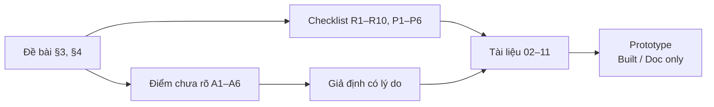

# 01 · Phân tích yêu cầu, giả định và phạm vi

## Mục đích

Tài liệu này chuyển yêu cầu của đề bài (§3, §4) thành checklist có thể kiểm tra. Nó cũng liệt kê các điểm đề bài chưa nói rõ và các giả định được dùng.

## Sơ đồ: từ yêu cầu đến tài liệu

## Checklist: Solution Plan phải trả lời (§3)

| # | Yêu cầu | Trả lời tại |
|---|---|---|
| R1 | Kiến trúc tổng thể từ web app đến Mac mini và quá trình tạo file | [03](03-architecture.md) |
| R2 | Dữ liệu được gửi đi như thế nào | [04](04-data-flow-and-api.md) |
| R3 | Mac mini nhận một yêu cầu mới như thế nào | [04](04-data-flow-and-api.md), [05](05-job-lifecycle.md) |
| R4 | Một tác vụ được khởi chạy như thế nào | [05](05-job-lifecycle.md) |
| R5 | Kết quả được trả về và lưu lại như thế nào | [04](04-data-flow-and-api.md) |
| R6 | Hệ thống biết báo giá đang chờ, đang chạy, đã xong hay lỗi bằng cách nào | [05](05-job-lifecycle.md) |
| R7 | Vai trò thực sự của Codex CLI: phần nào dùng AI, phần nào dùng code xác định | [07](07-ai-codex-role.md) |
| R8 | Rủi ro: dữ liệu sai, gửi trùng, Mac mini mất kết nối, lỗi giữa chừng, retry, file sai | [08](08-reliability-and-errors.md) |
| R9 | Authn, authz, validation, logging, bảo vệ dữ liệu khách hàng | [09](09-security.md) |
| R10 | Lý do của từng lựa chọn và ảnh hưởng của các thay đổi so với workflow | [00](00-overview.md), [10](10-tech-choices.md) |

## Checklist: prototype phải làm được (§4)

| # | Yêu cầu | Trạng thái |
|---|---|---|
| P1 | Chạy được luồng chính từ đầu đến cuối | ✅ Built |
| P2 | Dùng dữ liệu giả lập | ✅ Seed 3 khách hàng, 6 sản phẩm, 3 tài khoản |
| P3 | UI đơn giản, tập trung vào workflow | ✅ |
| P4 | Mở khách hàng → Tạo báo giá → nhập → gửi → nhận file tạo từ mẫu | ✅ Built |
| P5 | Định dạng file có lý do kỹ thuật | ✅ DOCX (xem [10](10-tech-choices.md)) |
| P6 | Nêu rõ phần mock và cách thay thế | ✅ [11](11-prototype-and-production.md) |

## Điểm chưa rõ và giả định

| # | Điểm chưa rõ | Giả định | Lý do |
|---|---|---|---|
| A1 | Workflow kết thúc ở "File báo giá hoàn chỉnh" nhưng không nói file đi đâu | File được **lưu lại và gắn với báo giá**. Người dùng tải về từ web bất cứ lúc nào | Báo giá là chứng từ kinh doanh, cần tải lại được và cần lưu vết |
| A2 | Web app chạy trên cloud hay trong LAN văn phòng | Thiết kế chạy được với **cả hai** nhờ mô hình pull | Mac mini thường nằm sau router, không có IP public |
| A3 | Người dùng có phải chờ file ngay trên màn hình không | **Không.** Xử lý bất đồng bộ và hiển thị trạng thái | Mac mini có thể offline, bước AI có thể chậm |
| A4 | Một báo giá gồm những thông tin gì | Nhiều dòng sản phẩm, VAT, điều khoản thanh toán và giao hàng, hiệu lực, ghi chú, đơn vị VND | Sát với nghiệp vụ của một công ty hoá chất |
| A5 | Ai bảo trì mẫu, mẫu thay đổi thường xuyên không | Nghiệp vụ tự soạn mẫu trong Word có placeholder. Mẫu **có phiên bản** | Người không biết code vẫn sửa được bố cục |
| A6 | Có bước duyệt trước khi gửi khách không | Nằm **ngoài phạm vi** | Đề bài không yêu cầu |

## Phạm vi

| Trong phạm vi | Ngoài phạm vi |
|---|---|
| Tạo báo giá, xử lý bất đồng bộ, theo dõi trạng thái, tải file, retry, lịch sử theo khách hàng | CRUD khách hàng và sản phẩm (dùng seed), quy trình duyệt, gửi email cho khách, đa tiền tệ, chữ ký số |

## Trong prototype

Toàn bộ checklist P1–P6 được đáp ứng. Mỗi mục R1–R10 đều có tài liệu thiết kế. Những phần chưa triển khai được đánh dấu **Doc only** trong từng file.
