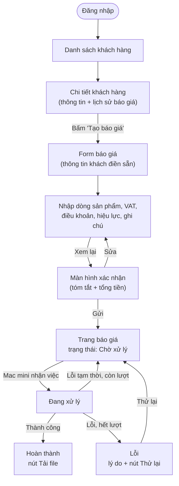

# 02 · Quy trình nghiệp vụ

## Mục đích

Tài liệu này mô tả quy trình tạo báo giá từ góc nhìn người dùng: ai làm gì, qua những màn hình nào và xử lý các tình huống nghiệp vụ ra sao. Các chi tiết kỹ thuật nằm ở file [03](03-architecture.md) đến [05](05-job-lifecycle.md).

## Tác nhân

| Tác nhân | Vai trò |
|---|---|
| **Nhân viên kinh doanh (Sales)** | Tạo báo giá, theo dõi và tải file báo giá **của mình** |
| **Admin / Quản lý** | Xem mọi báo giá, retry báo giá lỗi, xem trạng thái Mac mini |
| **Mac mini Agent** | Tác nhân hệ thống, tự động tạo file |
| Khách hàng | Nhận báo giá. Việc gửi cho khách nằm ngoài phạm vi |

## Sơ đồ quy trình

Người dùng **không cần ngồi chờ** ở trang báo giá. Báo giá luôn hiện trong lịch sử của khách hàng cùng trạng thái hiện tại.

## Nội dung một báo giá

| Nhóm | Trường |
|---|---|
| Đầu báo giá | Số báo giá tự sinh (`BG-2026-0001`), ngày, nhân viên phụ trách, thông tin khách hàng (tên, MST, địa chỉ, người liên hệ) |
| Dòng sản phẩm (nhiều dòng) | Tên, quy cách, đơn vị, số lượng, đơn giá (mặc định lấy giá niêm yết, cho phép sửa), thành tiền |
| Tổng | Tạm tính, VAT, tổng cộng, số tiền bằng chữ (VND) |
| Điều khoản | Thanh toán, giao hàng, hiệu lực đến ngày, ghi chú |

## Quy tắc nghiệp vụ và các tình huống

**Quy tắc cốt lõi: báo giá đã gửi thì không sửa (immutable).** File luôn khớp với dữ liệu, lịch sử rõ ràng, và không có xung đột giữa việc sửa và việc Mac mini đang xử lý.

| Tình huống | Cách xử lý | Prototype |
|---|---|---|
| Tạo báo giá | Form → Xem lại → Gửi | ✅ Built |
| Bấm "Gửi" hai lần hoặc mạng chập chờn | Idempotency key, chỉ tạo **một** báo giá | ✅ Built |
| Tải lại file | Tải **đúng file đã lưu**, không tạo lại | ✅ Built |
| Báo giá lỗi | Tự retry tối đa 3 lần, sau đó hiện "Lỗi" kèm lý do và nút **Thử lại** | ✅ Built |
| Xem lịch sử | Danh sách báo giá theo khách hàng và timeline sự kiện của từng báo giá | ✅ Built |
| Mac mini mất kết nối | Báo giá nằm chờ, UI báo *"Mac mini đang mất kết nối"* | ✅ Built |
| **Sửa báo giá** | Tạo báo giá mới điền sẵn từ báo giá cũ (`replaces_quote_id`). Báo giá cũ tự chuyển **Đã huỷ** với lý do "Được thay thế bởi BG-…" | 📄 Doc only |
| **Tạo bản sao** | Tạo báo giá mới điền sẵn. Báo giá cũ **vẫn hiệu lực** (dùng cho khách khác hoặc đơn lặp lại) | 📄 Doc only |
| **Huỷ** (bắt buộc ghi lý do) | Chờ xử lý: huỷ ngay. Đang xử lý: agent bị từ chối ở bước tiếp theo và tự dọn dẹp. Hoàn thành: *void*, file được giữ lại để lưu vết | 📄 Doc only |
| Quá hạn hiệu lực | Hiển thị nhãn **"Hết hiệu lực"**, tính từ `validUntil`. Đây là nhãn, không phải trạng thái | 📄 Doc only |
| Khách hàng hoặc giá sản phẩm thay đổi sau khi gửi | Báo giá không đổi nhờ snapshot | ✅ Built |
| Mẫu báo giá có phiên bản mới | Báo giá cũ giữ nguyên file. Báo giá mới dùng phiên bản mới | 📄 Doc only (lưu phiên bản, hiện chỉ có v1) |

### Phân biệt 3 thao tác dễ nhầm

| | Tải lại | Tạo bản sao | Sửa báo giá |
|---|---|---|---|
| Số báo giá mới? | Không | Có | Có |
| Tạo file mới? | Không | Có | Có |
| Báo giá cũ | Giữ nguyên | Vẫn hiệu lực | Đã huỷ ("Được thay thế bởi…") |

## Trong prototype

**Built:** luồng chính, trạng thái, retry, lịch sử, cảnh báo offline, chống gửi trùng.
**Doc only:** huỷ, sửa, tạo bản sao, nhãn hết hiệu lực, nhiều phiên bản mẫu.
