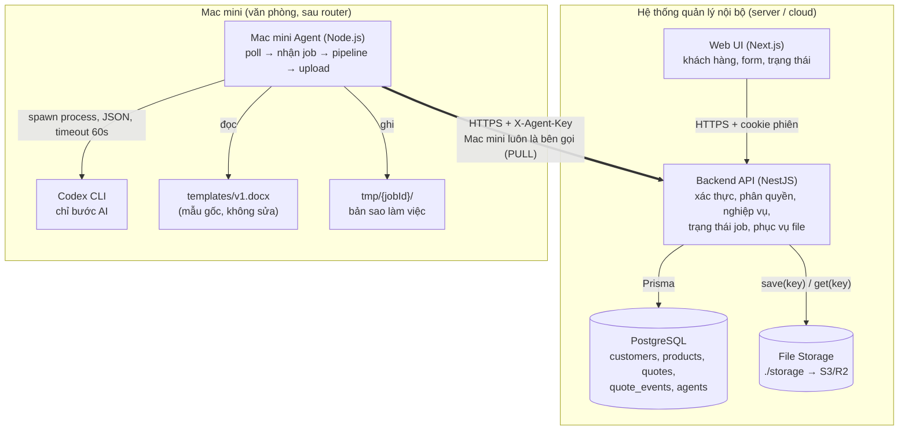
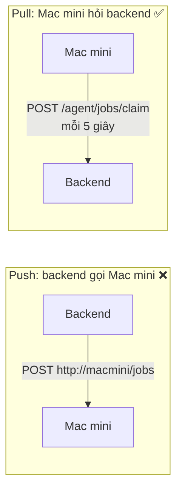

# 03 · Kiến trúc hệ thống

## Mục đích

Tài liệu này trả lời **R1**: hệ thống gồm những thành phần nào, mỗi thành phần chạy ở đâu và giao tiếp với nhau ra sao.

## Sơ đồ thành phần

## Các thành phần

| Thành phần | Trách nhiệm | Không làm |
|---|---|---|
| **Web UI** | Hiển thị, nhập liệu, validate sơ bộ, poll trạng thái | Không tính tiền chính thức, không quyết định quyền |
| **Backend API** | Nguồn sự thật duy nhất: xác thực, phân quyền, validate, **tính tổng tiền**, tạo snapshot, quản lý trạng thái job, lưu và phục vụ file | Không tạo file DOCX |
| **PostgreSQL** | Lưu dữ liệu nghiệp vụ. **Cột trạng thái của báo giá chính là hàng đợi** | — |
| **File Storage** | Lưu file báo giá theo key tương đối (`quotes/2026/BG-2026-0001.docx`) | Không public trực tiếp |
| **Mac mini Agent** | Hỏi việc, chạy pipeline (validate → AI → điền mẫu → kiểm tra → upload), báo kết quả | **Không truy cập DB**, không quyết định trạng thái |
| **Codex CLI** | Chuẩn hoá văn bản tự do (ghi chú, điều khoản) | Không động vào số liệu, không điền mẫu |
| **Template** | Mẫu Word có placeholder (`{quoteNo}`, `{#items}…{/items}`) | Không bao giờ bị ghi đè |

## Quy tắc giao tiếp

| Kết nối | Cách thức | Lý do |
|---|---|---|
| Browser ↔ Backend | HTTPS REST, phiên đăng nhập (cookie httpOnly) | Chuẩn phổ biến. Backend kiểm soát mọi quy tắc |
| Agent → Backend | HTTPS REST với **API key riêng** (`X-Agent-Key`). Agent luôn là bên chủ động gọi | Mô hình pull (bên dưới). Thông tin xác thực của máy tách khỏi tài khoản người dùng |
| Agent ↔ Database | **Không có kết nối** | DB không phải mở ra mạng. Quy tắc nghiệp vụ nằm ở một chỗ. Agent có thể được thay thế hoặc nhân bản |
| Agent → Codex CLI | Chạy tiến trình con cục bộ, vào/ra bằng JSON, có timeout | Codex là CLI nên agent gọi như một lệnh. Timeout để không bị treo |
| Agent → Template | Đọc file mẫu, ghi ra **bản sao tạm** | Đúng workflow: "điền vào bản sao của mẫu". Mẫu gốc không bị sửa |

## Quyết định và lý do

### 1. Pull thay vì push

| Tiêu chí | Push | Pull |
|---|---|---|
| Mac mini sau router, không có IP public | Phải mở cổng hoặc dùng VPN/tunnel | ✅ Chỉ cần gọi ra ngoài |
| Mac mini tắt hoặc mất mạng | Request thất bại, cần tự xây retry | ✅ Job nằm chờ, xử lý khi Mac mini kết nối lại |
| Bảo mật | Mở một cổng vào trong văn phòng | ✅ Không có cổng vào |
| Độ trễ | Tức thì | Tối đa khoảng 5 giây, chấp nhận được với một file báo giá |

### 2. File được tạo trên Mac mini (giữ đúng workflow)

Mẫu và Codex nằm trên Mac mini, backend được giữ gọn. Ở tầng này không có thay đổi nào so với sơ đồ của công ty.

### 3. Không dùng message queue riêng

Cột `status` của bảng `quotes` được dùng làm hàng đợi. Mỗi job được nhận nguyên tử bằng `FOR UPDATE SKIP LOCKED` (xem [05](05-job-lifecycle.md)). Ở quy mô SME, cách này bớt được một thành phần phải vận hành và giải thích.

## Trong prototype

**Built:** toàn bộ các thành phần. "Mac mini" là tiến trình agent chạy trên máy dev. Codex chạy ở chế độ mock. Storage là thư mục `./storage`.
**Cách thay thế khi đưa vào vận hành:** xem [11](11-prototype-and-production.md).
