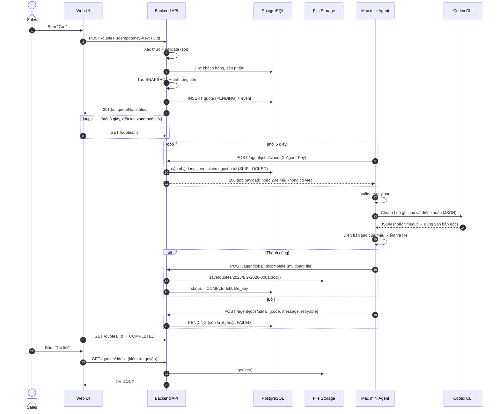
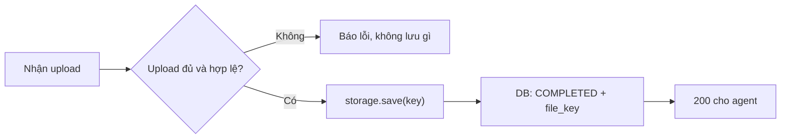

# 04 · Luồng dữ liệu và API

## Mục đích

Tài liệu này trả lời **R2** (dữ liệu được gửi đi thế nào), **R3** (Mac mini nhận yêu cầu thế nào) và **R5** (kết quả được trả về và lưu thế nào).

## Sơ đồ tuần tự



## Quyết định chính

1. **Backend tạo snapshot đầy đủ khi người dùng gửi.** Job chứa mọi thứ cần để tạo file. Agent không phải tra cứu gì thêm, đúng với quy tắc agent không truy cập DB ([03](03-architecture.md)). Nếu giá sản phẩm thay đổi sau đó, báo giá vẫn giữ giá cũ, vì báo giá là cam kết tại một thời điểm và có hiệu lực đến `validUntil`.
2. **Backend tính tổng tiền, không tin số liệu từ trình duyệt.** Trình duyệt chỉ hiển thị bản xem trước, dùng chung hàm tính với backend. Màn hình xác nhận, DB và file luôn khớp nhau. Tiền được lưu bằng **số nguyên VND** để không có sai số dấu phẩy động.
3. **File được upload ngược về backend**, không để agent ghi thẳng vào storage. Mọi quyền truy cập đi qua một cửa duy nhất. Khi dùng S3 trong production, bước này có thể đổi sang presigned URL.
4. **UI dùng polling mỗi 3 giây** thay vì WebSocket hay SSE (bảng so sánh bên dưới).

### Polling, SSE hay WebSocket?

| | Polling ✅ | SSE | WebSocket |
|---|---|---|---|
| Cơ chế | Trình duyệt gọi GET định kỳ | Server đẩy sự kiện một chiều qua kết nối mở | Kết nối hai chiều thường trực |
| Độ phức tạp | Rất thấp, HTTP thường | Cần pub/sub khi có nhiều instance, cấu hình proxy | Cao nhất: xác thực socket, heartbeat, sticky session |
| Phù hợp khi | Ít thay đổi, ít người dùng | Cần đẩy tức thì một chiều | Chat, cộng tác thời gian thực |

Trạng thái thay đổi khoảng 3 lần cho mỗi báo giá, mỗi lần tạo chỉ mất vài giây, người dùng là một nhóm nhân viên nội bộ nhỏ, và độ trễ 3 giây là chấp nhận được. Polling dừng khi đạt trạng thái cuối. **Hướng nâng cấp:** SSE kết hợp Postgres `LISTEN/NOTIFY`.

## Hợp đồng dữ liệu: job payload (backend → Mac mini)

```json
{
  "jobId": "clx8f3a...",
  "quoteNo": "BG-2026-0001",
  "attempt": 1,
  "templateVersion": "v1",
  "createdAt": "2026-09-25T09:30:00+07:00",
  "salesperson": { "name": "Nguyễn Văn A", "email": "sales.a@anbinh.test" },
  "customer": {
    "code": "KH001", "name": "Công ty TNHH Hóa chất Minh Phát",
    "taxCode": "0312345678", "address": "KCN Tân Bình, TP.HCM",
    "contactName": "Trần Thị B", "phone": "0901234567", "email": "b@minhphat.test"
  },
  "items": [
    { "sku": "NAOH-99", "name": "Xút vảy NaOH 99%", "spec": "Bao 25kg",
      "unit": "kg", "quantity": 1000, "unitPrice": 12500, "lineTotal": 12500000 }
  ],
  "vatRate": 8, "subtotal": 12500000, "vatAmount": 1000000, "total": 13500000,
  "paymentTerms": "Chuyển khoản 30 ngày",
  "deliveryTerms": "Giao tại kho khách hàng trong 5 ngày",
  "validUntil": "2026-10-25",
  "notes": "giá chưa gồm bx, giao trong giờ hc"
}
```

Payload có **cùng một schema (zod)** và được validate ở 3 nơi: form trên web, backend khi nhận, agent trước khi tạo file.

## Danh sách API

| Method & path | Ai gọi | Mô tả |
|---|---|---|
| `POST /auth/login` · `POST /auth/logout` · `GET /auth/me` | Người dùng | Đăng nhập bằng cookie phiên |
| `GET /customers` · `GET /customers/:id` | Người dùng | Danh sách và chi tiết khách hàng (kèm báo giá mà người dùng được xem) |
| `GET /products` | Người dùng | Danh mục sản phẩm |
| `POST /quotes` | Người dùng | Tạo báo giá. Header `Idempotency-Key` bắt buộc |
| `GET /quotes/:id` | Người dùng | Trạng thái, timeline, trạng thái agent |
| `GET /quotes/:id/file` | Người dùng | Tải file (kiểm tra quyền sở hữu) |
| `POST /quotes/:id/retry` | Người dùng | Chuyển FAILED → PENDING |
| `POST /agent/jobs/claim` | Agent | Nhận một job (200) hoặc không có việc (204). Cập nhật `last_seen` |
| `POST /agent/jobs/:id/complete` | Agent | Upload file (multipart) → COMPLETED |
| `POST /agent/jobs/:id/fail` | Agent | Báo lỗi `{code, message, retryable}` |
| `POST /agent/jobs/:id/events` | Agent | Ghi thông tin vào timeline, ví dụ AI đã chuẩn hoá, AI fallback hoặc cảnh báo mâu thuẫn. Không ảnh hưởng trạng thái |
| `GET /agent-status` | Người dùng | Mac mini đang online hay offline (`last_seen_at`) |

## Thứ tự lưu kết quả (an toàn khi bị ngắt giữa chừng)



**Quy tắc: DB không bao giờ ở trạng thái COMPLETED khi chưa có file.** Nếu bị ngắt ở bất kỳ bước nào, job sẽ được xử lý lại. Key của file là cố định theo số báo giá, nên lần sau sẽ ghi đè file mồ côi nếu có (chi tiết ở [08](08-reliability-and-errors.md)).

## Trong prototype

**Built:** toàn bộ luồng và API trong bảng trên, snapshot, tính tổng tiền ở backend, polling.
**Doc only:** kiểm tra checksum sha256 khi upload, presigned URL cho S3, SSE.
