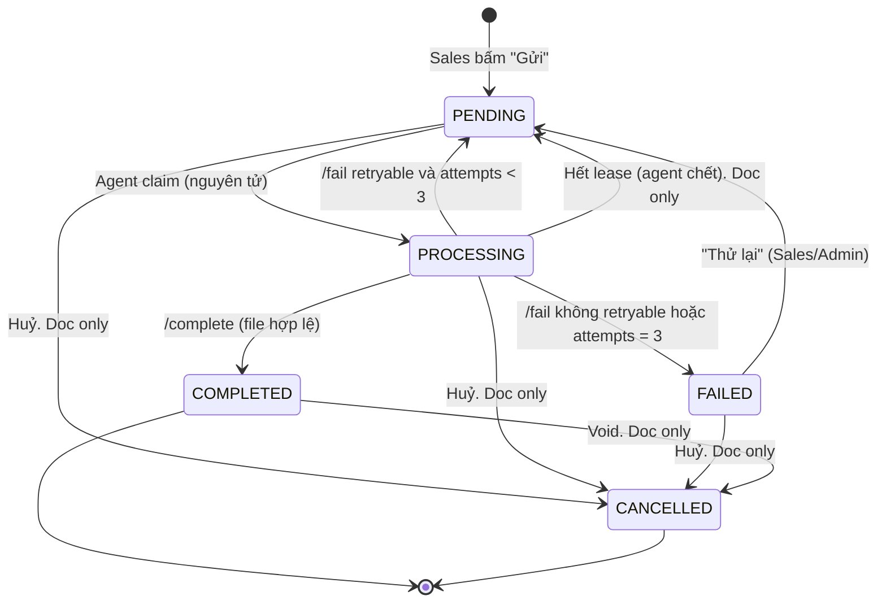
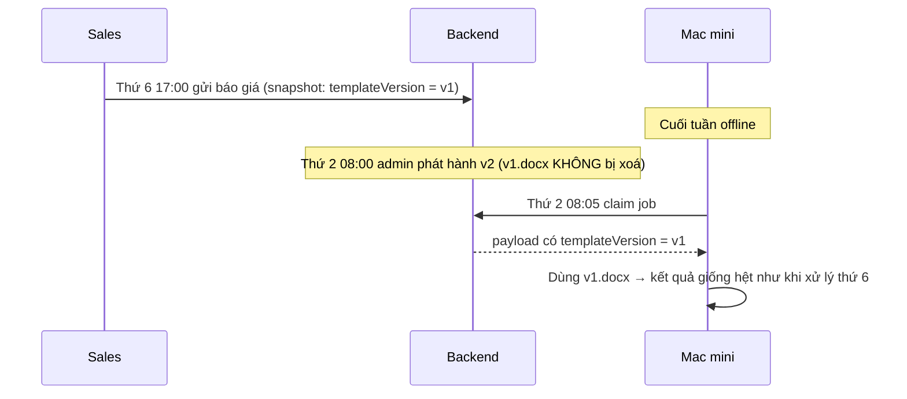

# 05 · Vòng đời job và trạng thái

## Mục đích

Tài liệu này trả lời **R4** (một tác vụ được khởi chạy thế nào) và **R6** (hệ thống biết báo giá đang ở trạng thái nào bằng cách nào).

## Sơ đồ trạng thái



| Trạng thái | Hiển thị | Ý nghĩa |
|---|---|---|
| `PENDING` | Chờ xử lý | Đang nằm trong hàng đợi. Có thể Mac mini đang offline |
| `PROCESSING` | Đang xử lý | Một agent đã nhận job |
| `COMPLETED` | Hoàn thành | File đã được lưu và có thể tải |
| `FAILED` | Lỗi | Hết lượt retry hoặc lỗi không thể retry. Có hiển thị lý do |
| `CANCELLED` | Đã huỷ | *(Doc only)* Kết thúc do người dùng huỷ |

"Hết hiệu lực" là **nhãn hiển thị** tính từ `validUntil`, không phải trạng thái.

## Ai được đổi trạng thái

**Chỉ backend ghi trạng thái.** Agent chỉ *yêu cầu* chuyển trạng thái qua API, và backend kiểm tra yêu cầu đó có hợp lệ không. Ví dụ, `/complete` chỉ được chấp nhận khi job đang `PROCESSING` **và** đang do chính agent đó giữ (`locked_by`). Nhờ vậy có thể chặn trường hợp một agent cũ mất mạng, quay lại và nộp kết quả cho job đã được giao cho agent khác.

Mọi lần chuyển trạng thái đều được ghi vào `quote_events` (thời điểm, từ → đến, ai thực hiện, thông điệp). UI dùng bảng này để hiển thị timeline, và developer dùng nó để debug.

## Một tác vụ được khởi chạy thế nào (claim nguyên tử)

Vấn đề: hai tiến trình agent, hoặc một agent gửi lại request, có thể cùng nhận một job và tạo ra file trùng.
Giải pháp: nhận job bằng **một câu lệnh SQL nguyên tử**:

```sql
UPDATE quotes
SET status = 'PROCESSING', locked_by = $agentId,
    locked_until = now() + interval '5 minutes', attempts = attempts + 1
WHERE id = (
  SELECT id FROM quotes
  WHERE status = 'PENDING' AND next_run_at <= now()
  ORDER BY created_at
  FOR UPDATE SKIP LOCKED
  LIMIT 1
)
RETURNING *;
```

Diễn giải: *"Lấy job PENDING cũ nhất đã đến hạn, khoá nó lại, chuyển sang PROCESSING, giao cho tôi. Nếu tiến trình khác đang khoá job đó thì bỏ qua."* Với một Mac mini, câu lệnh này vẫn đúng. Nếu công ty thêm Mac mini thứ hai thì không phải sửa gì.

Mỗi lần agent gọi claim, backend cũng cập nhật `agents.last_seen_at`. Dữ liệu này dùng cho cảnh báo **"Mac mini đang mất kết nối"**: UI hiện cảnh báo khi báo giá đang chờ và agent không xuất hiện quá 60 giây.

## Retry

| Loại lỗi | Ví dụ | Xử lý |
|---|---|---|
| **Retryable** | Lỗi mạng khi upload, đĩa đầy, lỗi tạm thời | Quay về `PENDING`, `next_run_at = now + 30s × attempt`. Tối đa 3 lần |
| **Không retryable** | Payload sai schema, thiếu hoặc hỏng mẫu, file đầu ra không đạt kiểm tra | `FAILED` ngay, vì chạy lại vẫn cho cùng kết quả và cần người kiểm tra |

Codex lỗi hoặc timeout **không làm job thất bại**. Agent dùng văn bản gốc và tiếp tục ([07](07-ai-codex-role.md)).

## Mac mini tắt giữa chừng: chạy lại hay chạy tiếp?

**Chạy lại từ đầu, và mọi bước đều an toàn khi lặp lại (idempotent).** Tạo một báo giá chỉ mất vài giây, và không có gì thay đổi bên ngoài Mac mini cho đến lần upload cuối cùng. Lưu checkpoint sẽ thêm độ phức tạp mà gần như không đem lại lợi ích.

| Điều kiện để chạy lại an toàn | Cách đảm bảo |
|---|---|
| Đầu vào không đổi | Snapshot đã đóng băng: cùng job thì ra cùng file |
| Không bị rác từ lần chạy trước | Mỗi lần chạy dùng thư mục riêng `tmp/{jobId}/{attempt}`, được dọn khi agent khởi động |
| Không lộ kết quả dở dang | File chỉ có hiệu lực sau khi `/complete` thành công, và mỗi job chỉ được complete một lần |
| Job không bị treo mãi | *(Doc only)* Lease 5 phút. Tác vụ định kỳ mỗi phút đưa job hết lease về `PENDING`. Agent tự khởi động cùng máy (launchd) |
| Bước AI không đổi kết quả khi chạy lại | *(Doc only)* Lưu kết quả AI vào `ai_result` và dùng lại ở lần retry |

## Phiên bản mẫu được chốt khi gửi



Mac mini không tự chọn mẫu. Nó dùng đúng phiên bản ghi trong job. Nếu thiếu phiên bản đó thì báo lỗi không retryable.

## Trong prototype

**Built:** 4 trạng thái PENDING/PROCESSING/COMPLETED/FAILED, claim nguyên tử, auto-retry tối đa 3 lần, nút Thử lại, timeline `quote_events`, cảnh báo Mac mini offline, thư mục tạm cho mỗi lần chạy.
**Doc only:** CANCELLED, lease + heartbeat + sweep, lưu lại kết quả AI để dùng lại, nhiều phiên bản mẫu (trường `template_version` có lưu nhưng hiện chỉ có v1).
