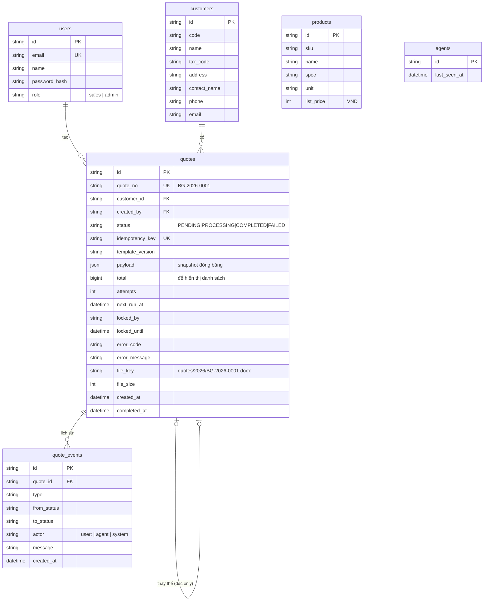

# 06 · Mô hình dữ liệu

## Mục đích

Tài liệu này mô tả các bảng dữ liệu. Mô hình được giữ **tối giản để dễ demo**: 6 bảng, chỉ dùng những ràng buộc bảo vệ tính đúng đắn.

## Sơ đồ ER

`products` không có quan hệ khoá ngoại với `quotes`, vì thông tin sản phẩm đã được **chép vào snapshot** tại thời điểm gửi.

## Quyết định và lý do

| Quyết định | Lý do | Đánh đổi |
|---|---|---|
| **Các dòng sản phẩm nằm trong `payload` (JSON)**, không có bảng `quote_items` | Snapshot không bao giờ bị sửa, luôn được đọc nguyên khối, không cần join | Khó làm báo cáo kiểu "báo giá nào có NaOH". Khi cần thì thêm `quote_items` |
| **Không có bảng `jobs` riêng**. Các trường của job nằm ngay trên `quotes` | Một báo giá tương ứng một job. Mỗi lần retry là một lần thử trên cùng dòng dữ liệu | `quote_events` đã ghi lại lịch sử từng lần thử |
| **Chỉ 5 loại ràng buộc**: PK, FK, `quote_no` UNIQUE, `idempotency_key` UNIQUE, `email` UNIQUE | Đủ để bảo vệ tính đúng đắn. Ràng buộc UNIQUE trên idempotency key là thứ làm cho chống gửi trùng hoạt động | Trạng thái là text và được validate trong code |
| **Tiền lưu bằng số nguyên VND** | Không có sai số dấu phẩy động | — |
| **`file_key` là đường dẫn tương đối** | Dùng được cho cả local và S3 mà không cần migrate dữ liệu | — |
| `quote_no` tự sinh từ sequence và năm | Đơn giản, không trùng | Số thứ tự không reset theo năm (chấp nhận được) |
| Trường Doc only (`ai_result`, `replaces_quote_id`, `cancel_reason`, `file_sha256`) **không tạo** trong prototype | Giữ schema gọn để demo | Thêm bằng một migration khi triển khai các tính năng đó |

## Trong prototype

**Built:** 6 bảng như sơ đồ, Prisma migration và seed (3 khách hàng, 6 sản phẩm, 3 tài khoản `sales.a`, `sales.b`, `admin`).
