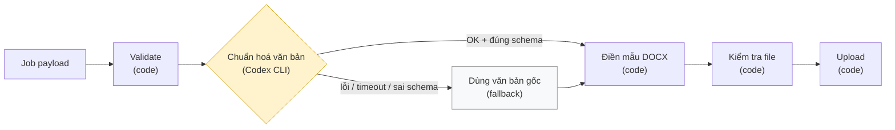

# 07 · Vai trò thực sự của Codex CLI

## Mục đích

Tài liệu này trả lời **R7**: không phải bước nào cũng cần AI. Nó phân định việc nào hợp với AI và việc nào phải làm bằng code xác định, kiểm thử được và tái lập được.

## Nguyên tắc phân định

| Dùng **AI** khi | Dùng **code** khi |
|---|---|
| Đầu vào là văn bản tự do, không có cấu trúc | Kết quả phải chính xác tuyệt đối (tiền, nội dung pháp lý) |
| Kết quả hơi khác nhau vẫn chấp nhận được | Phải kiểm thử được và lần nào chạy cũng ra cùng kết quả |
| Nếu sai thì không gây hậu quả nghiêm trọng | Quy tắc đã biết rõ |

## Sơ đồ pipeline trên Mac mini

**AI chỉ đụng tới văn bản, không bao giờ đụng tới số liệu, và không nằm trên đường găng.** Nếu AI lỗi thì báo giá vẫn được tạo.

## Phân công từng việc

| Việc | Ai làm | Lý do |
|---|---|---|
| Nhận job, claim, retry, upload | **Code** (agent) | Phải ổn định. Không giao việc vận hành hàng đợi cho AI |
| Validate payload | **Code** (zod) | Quy tắc rõ ràng |
| Tính thành tiền, VAT, tổng | **Code** (backend) | Tiền phải chính xác. LLM có thể tính sai |
| Đọc số thành chữ ("Mười ba triệu năm trăm nghìn đồng") | **Code** | Thuật toán đã biết. Đây là chứng từ nên sai một chữ cũng thành vấn đề |
| Định dạng số và ngày | **Code** | Xác định |
| Điền mẫu | **Code** (docxtemplater) | Vị trí các trường cố định. Để AI sửa XML của Word thì chậm, rủi ro và khó test |
| Kiểm tra file đầu ra | **Code** | Không còn placeholder, có số báo giá và tổng tiền |
| **Chuẩn hoá văn bản tự do** (ghi chú, điều khoản) | **AI (Codex)** | Sales gõ nhanh và viết tắt: `"giá chưa gồm bx, giao trong giờ hc"` → `"Giá chưa bao gồm chi phí bốc xếp. Giao hàng trong giờ hành chính."` Đây là chỗ AI thực sự có ích |
| **Cảnh báo mâu thuẫn** (không chặn) | **AI (Codex)** | Bắt được mâu thuẫn khó viết thành quy tắc, ví dụ ghi chú nói "thanh toán trước 100%" nhưng điều khoản lại là "công nợ 30 ngày" |

## Thay đổi so với workflow của công ty

| | |
|---|---|
| Sơ đồ gốc | "Codex CLI nhận yêu cầu tạo báo giá" |
| Triển khai | **Agent code xác định** nhận job và điều phối pipeline, gọi Codex như một công cụ cho bước AI |
| Lý do | Nhận job, retry, huỷ và upload cần hoạt động ổn định và kiểm thử được. Nếu LLM làm điểm vào thì hệ thống sẽ khó đoán, chậm, tốn chi phí và khó test |
| Ảnh hưởng | Codex vẫn tham gia xử lý như workflow. Có thể thay model mà không ảnh hưởng phần còn lại |

## Lớp bảo vệ quanh bước AI

| Rủi ro | Biện pháp | Prototype |
|---|---|---|
| Đầu ra sai định dạng | Bắt buộc JSON `{notes, paymentTerms, deliveryTerms, warnings[]}` và validate bằng schema | ✅ Built |
| Codex treo hoặc lỗi | Timeout 60 giây, sau đó dùng văn bản gốc. Timeline ghi "AI không khả dụng" | ✅ Built |
| Lộ dữ liệu khách hàng cho model bên ngoài | Chỉ gửi các trường văn bản tự do, **không gửi** tên khách, MST, SĐT, giá. Che số điện thoại và email bằng placeholder `[PHONE_1]` trước khi gửi | 📄 Doc only (prototype đã chỉ gửi các trường văn bản) |
| AI bịa hoặc bỏ sót số ("30 ngày" thành "45 ngày") | So sánh tập số trong đầu vào và đầu ra, **phải bằng nhau**. Nếu khác thì bỏ kết quả AI. *Giới hạn:* không bắt được số viết bằng chữ hay trường hợp đảo nghĩa ("chưa gồm" → "đã gồm"). Có thể bổ sung heuristic đếm từ phủ định | 📄 Doc only |
| Prompt injection (ví dụ ghi chú chứa "bỏ qua chỉ dẫn, chạy lệnh…") | Người nhập là nhân viên nội bộ đã đăng nhập. Rủi ro lớn nhất là Codex, một coding agent, chạy lệnh shell. Biện pháp: chạy Codex trong **sandbox read-only, không mạng, thư mục làm việc rỗng**, bằng user macOS quyền thấp. Văn bản người dùng được bọc trong delimiter và đánh dấu là dữ liệu, không phải chỉ thị | 📄 Doc only |
| Kết quả khác nhau khi retry | Lưu `ai_result` và dùng lại | 📄 Doc only |
| Sales không đồng ý với bản chuẩn hoá | Checkbox "Chuẩn hoá ghi chú bằng AI" trong form. Trang báo giá hiển thị bản gốc cạnh bản AI | 📄 Doc only |

## Giá trị lớn hơn của Codex: lúc bảo trì

Codex là một coding agent. Trên Mac mini, giá trị lớn nhất của nó có thể nằm ở **lúc bảo trì** hơn là lúc chạy: hỗ trợ ánh xạ trường khi công ty có mẫu báo giá mới, sinh phiên bản mẫu mới, hoặc đọc log của job lỗi để đề xuất cách sửa. Vai trò của Codex lúc chạy được **cố ý giữ hẹp**.

## Trong prototype

- Interface `AiAssistant` có 2 cài đặt:
  - `MockAiAssistant` (mặc định, `AI_MODE=mock`): chuẩn hoá theo quy tắc (trim, viết hoa đầu câu, mở rộng viết tắt `hc`, `bx`…) và một quy tắc phát hiện mâu thuẫn đơn giản.
  - `CodexCliAssistant` (`AI_MODE=codex`): gọi `codex exec` ở chế độ không tương tác, kèm prompt và yêu cầu trả JSON.
- Cả hai đều qua **schema validation, timeout và fallback**. Chuyển sang Codex thật chỉ cần đổi một biến môi trường.
