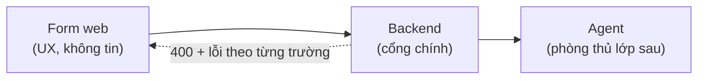
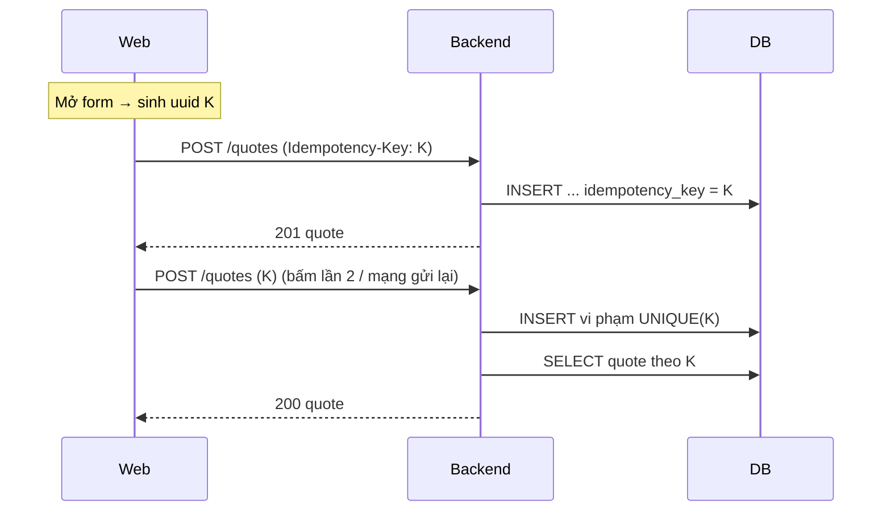

# 08 · Độ tin cậy và xử lý lỗi

## Mục đích

Tài liệu này trả lời **R8**: nhận diện các rủi ro vận hành thường gặp và hướng xử lý cho từng rủi ro.

## Bảng rủi ro

| Rủi ro (§3) | Cách xử lý | Chi tiết | Prototype |
|---|---|---|---|
| Dữ liệu đầu vào không hợp lệ | Một schema, validate ở 3 nơi | Bên dưới | ✅ Web + backend. Agent re-validate: Doc only |
| Gửi cùng một yêu cầu nhiều lần | Idempotency key | Bên dưới | ✅ |
| Mac mini tạm mất kết nối | Pull: job nằm chờ, UI cảnh báo offline | [03](03-architecture.md), [05](05-job-lifecycle.md) | ✅ |
| Tiến trình thất bại giữa chừng | Chạy lại an toàn: thư mục tạm cho mỗi lần chạy, chỉ complete một lần. Lease được thu hồi khi agent chết | [05](05-job-lifecycle.md) | ✅ Thư mục tạm + complete một lần. Lease: Doc only |
| Tác vụ cần retry | Tự retry 3 lần với lỗi tạm thời. Nút "Thử lại" thủ công | [05](05-job-lifecycle.md) | ✅ (backoff: Doc only) |
| File đầu ra không đúng | Kiểm tra file trước khi upload | Bên dưới | ✅ |
| AI lỗi hoặc trả kết quả xấu | Schema, timeout, dùng văn bản gốc | [07](07-ai-codex-role.md) | ✅ |
| Huỷ khi đang xử lý | Backend từ chối kết quả nộp muộn, agent tự dọn | [05](05-job-lifecycle.md) | 📄 Doc only |
| Thiếu mẫu hoặc sai phiên bản | Lỗi không retryable, thông báo rõ ràng | [05](05-job-lifecycle.md) | ✅ |

## Dữ liệu không hợp lệ: validate ở 3 lớp

- **Web:** báo lỗi ngay khi nhập. Chỉ để trải nghiệm người dùng, không được tin.
- **Backend (cổng chính):** khách hàng tồn tại; mọi sản phẩm tồn tại; số lượng > 0; đơn giá là số nguyên ≥ 0; từ 1 đến 50 dòng; VAT ∈ {0, 5, 8, 10}; độ dài văn bản có giới hạn; hiệu lực từ 1 đến 90 ngày. **Backend tự tính lại tổng tiền.** Lỗi trả về theo từng trường, ví dụ `{"field": "items.0.quantity", "message": "Số lượng phải > 0"}`.
- **Agent:** validate lại payload trước khi tạo file, phòng lỗi ở backend hoặc lệch phiên bản. Lỗi ở bước này là lỗi không retryable.

## Gửi trùng: idempotency key

- Mỗi **lần mở form** sinh một key. Nút "Gửi" bị vô hiệu trong lúc đang gửi.
- **Vì sao không phát hiện trùng theo nội dung** (cùng khách, cùng sản phẩm trong 1 phút)? Vì Sales có thể cố ý tạo hai báo giá giống nhau. Key định danh *một lần bấm Gửi*, không định danh nội dung.
- Nguyên tắc này cũng áp dụng cho agent: `/complete` chỉ được chấp nhận một lần. Nếu agent gửi lại sau khi job đã COMPLETED thì backend trả OK mà không làm gì.

## File đầu ra không đúng: kiểm tra trước khi upload

Sau khi điền mẫu, agent **mở lại file vừa tạo** và kiểm tra:
1. File là DOCX hợp lệ, mở được.
2. **Không còn placeholder nào chưa được thay** (`{...}`).
3. Có số báo giá và tổng tiền đã định dạng trong nội dung.

Nếu không đạt, agent báo lỗi `OUTPUT_INVALID` (không retryable) kèm lý do trong timeline. *(Doc only: đối chiếu số dòng bảng với số sản phẩm; checksum sha256 khi upload.)*

## Bị ngắt khi đang upload

| Điểm bị ngắt | Chuyện gì xảy ra | Phục hồi |
|---|---|---|
| Mac mini tắt **trong lúc** upload | Backend nhận file không đầy đủ, request lỗi, không lưu gì. Trạng thái vẫn là PROCESSING | Hết lease → PENDING → agent tạo lại (cùng snapshot, cùng file) → upload lại |
| Backend lỗi **sau khi lưu file, trước khi cập nhật DB** | Có file mồ côi trong storage, trạng thái vẫn là PROCESSING | Retry ghi đè file **với cùng key** (`quotes/2026/BG-…docx`), không để lại rác |
| Mac mini tắt **sau khi backend đã xong** | Báo giá đã COMPLETED | Không cần làm gì. Nếu agent gửi lại `/complete` thì nhận OK |

## Logging để chẩn đoán

- Mỗi dòng log của backend và agent đều có `quoteId` và `attempt`.
- `quote_events` là timeline nghiệp vụ, dùng để truy từ lúc gửi đến lúc tải.
- **Không log** tên khách hàng, số điện thoại, nội dung payload hay secret.

## Trong prototype

Xem cột "Prototype" trong bảng rủi ro. Các mục Doc only đều đã có hướng xử lý cụ thể như mô tả ở trên.
