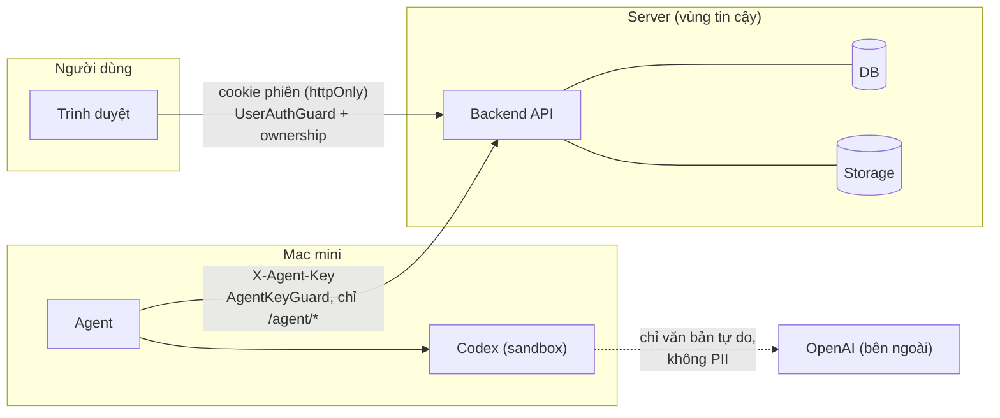

# 09 · Bảo mật và vận hành

## Mục đích

Tài liệu này trả lời **R9** ở mức phù hợp với một hệ thống nội bộ của SME, không theo thiết kế enterprise.

## Sơ đồ ranh giới tin cậy

## 1. Xác thực (ai đang gọi)

| Bên gọi | Cơ chế | Prototype |
|---|---|---|
| Nhân viên | Email + mật khẩu (bcrypt), sau đó JWT lưu trong **cookie httpOnly** (JavaScript trên trang không đọc được) | ✅ Tài khoản seed, hiển thị sẵn trên trang đăng nhập |
| Mac mini agent | **API key riêng**, dài và ngẫu nhiên, gửi trong header `X-Agent-Key`. Lưu ở biến môi trường, không đưa vào git | ✅ |
| Production | SSO Google Workspace / Microsoft 365 (không phải quản lý mật khẩu), giới hạn số lần đăng nhập sai, HTTPS bắt buộc, xoay vòng API key, chỉ cho phép IP văn phòng gọi `/agent/*` | 📄 Doc only |

## 2. Phân quyền (được làm gì)

| Vai trò | Quyền |
|---|---|
| **Sales** | Xem mọi khách hàng. Tạo báo giá. Chỉ xem, tải và thử lại báo giá **của mình** |
| **Admin** | Xem, tải và thử lại **mọi** báo giá. Xem trạng thái Mac mini |

- Quyền được **kiểm tra ở backend**, không chỉ ẩn nút trên UI.
- **Kiểm tra quyền sở hữu ở mọi endpoint báo giá, kể cả tải file.** Nếu Sales B đoán được URL `/quotes/123/file` của Sales A, backend trả **404** (không trả 403, để không xác nhận báo giá đó có tồn tại). Đây là lỗ hổng phổ biến nhất trong ứng dụng nội bộ (IDOR).
- **Hai loại thông tin xác thực tách biệt:** API key của agent chỉ gọi được `/agent/*`, cookie của người dùng không gọi được `/agent/*`.

## 3. Validation

Xem [08](08-reliability-and-errors.md): một schema zod dùng chung, validate ở 3 lớp, backend là cổng chính.

## 4. Bảo vệ dữ liệu khách hàng

| Ở đâu | Biện pháp | Prototype |
|---|---|---|
| File báo giá | **Chỉ phục vụ qua endpoint có kiểm tra quyền.** Không có thư mục public, không có link đoán được | ✅ |
| DB và storage | Không mở ra internet. Agent chỉ đi qua API | ✅ (theo kiến trúc) |
| Gửi cho AI | Chỉ các trường văn bản tự do ([07](07-ai-codex-role.md)) | ✅ |
| Mac mini | Xoá file tạm sau khi upload | ✅ |
| Truyền tải | HTTPS ở mọi kết nối | 📄 Doc only |
| Production | S3 private kèm signed URL ngắn hạn, mã hoá ổ đĩa Mac mini (FileVault), agent chạy bằng user quyền thấp, backup DB và storage định kỳ | 📄 Doc only |

## 5. Logging và audit

- Log có cấu trúc, mỗi dòng có `quoteId` và `attempt`. **Không log** PII, payload hay secret, chỉ log **ID**. ✅
- Audit trail là `quote_events` (tạo, nhận việc, lỗi, hoàn thành, thử lại). ✅
- Ghi log tải file (ai tải, khi nào). 📄 Doc only

## 6. Vận hành

| Mục | Prototype |
|---|---|
| Cấu hình qua biến môi trường. Repo chỉ có `.env.example`, không commit secret | ✅ |
| Theo dõi sức khoẻ agent bằng `last_seen_at` và cảnh báo offline trên UI | ✅ |
| Agent chạy như service launchd trên macOS: tự khởi động cùng máy, tự khởi động lại khi crash | 📄 Doc only (demo chạy bằng terminal) |
