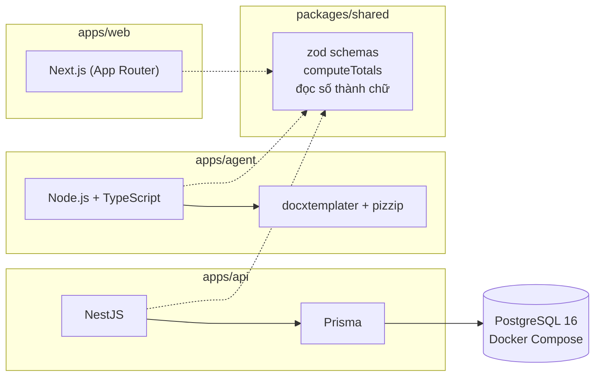

# 10 · Lựa chọn công nghệ

## Mục đích

Tài liệu này trả lời **R10** cho phần công nghệ. Nguyên tắc là *chọn công cụ mà đội phát triển thành thạo và vừa đủ cho quy mô. Công cụ nào có mặt cũng phải có lý do.*

## Sơ đồ công nghệ theo thành phần

## Lựa chọn và lý do

| Phần | Lựa chọn | Lý do |
|---|---|---|
| Frontend | **Next.js** | Stack thành thạo nhất của tác giả. UI chỉ gồm vài form và danh sách, không cần công nghệ mới |
| Backend | **NestJS** | Module và guard khớp với thiết kế: `UserAuthGuard` và `AgentKeyGuard` cho hai loại thông tin xác thực, kiểm tra quyền sở hữu ở một chỗ. API tách khỏi UI, đúng thứ agent cần |
| Database | **PostgreSQL** | Kiêm luôn hàng đợi (`FOR UPDATE SKIP LOCKED`), JSONB cho snapshot, transaction cho thứ tự "lưu file rồi mới đổi trạng thái" |
| ORM | **Prisma** | Schema, migration và seed nhanh, type TypeScript tốt. Câu claim dùng `$queryRaw`: một câu SQL rõ ràng, dễ giải thích |
| Agent | **Node.js + TypeScript**, không dùng framework | Cùng ngôn ngữ với backend nên dùng chung schema và type. Một vòng lặp poll không cần framework |
| Validation | **zod** trong `packages/shared` | Một định nghĩa schema dùng ở 3 nơi. `class-validator` của NestJS không dùng chung được cho web và agent |
| Tạo DOCX | **docxtemplater** | Nghiệp vụ tự soạn mẫu **trong Word** với placeholder `{quoteNo}` và vòng lặp bảng `{#items}…{/items}`. Người không biết code vẫn sửa được bố cục |
| Định dạng đầu ra | **DOCX** | Báo giá là văn bản trang trọng (tiêu đề công ty, điều khoản, chữ ký), mở được bằng Word ở mọi máy và dễ chuyển sang PDF về sau. XLSX hợp với số liệu cần chỉnh sửa, điều không mong muốn vì báo giá là immutable |
| Monorepo | **npm workspaces** | Một repo, một lệnh `npm install`, chia sẻ package chung. Có sẵn trong Node nên không cần cài thêm công cụ |
| Hạ tầng local | **Docker Compose (chỉ PostgreSQL)** | Khởi động DB bằng một lệnh. Các app chạy trực tiếp để phát triển nhanh |

## Cố ý không dùng

| Công nghệ | Vì sao không |
|---|---|
| Redis / BullMQ / RabbitMQ | PostgreSQL đủ làm hàng đợi ở quy mô SME, bớt một thành phần phải vận hành |
| WebSocket / SSE | Polling đủ tốt với tần suất thay đổi thấp ([04](04-data-flow-and-api.md)) |
| S3 (ngay bây giờ) | Dùng interface `FileStorage`, bản local chạy trước, sau này chuyển bằng cấu hình |
| Microservices / Kubernetes | Quá mức cần thiết cho một nghiệp vụ nội bộ |

## Đánh đổi

Chạy 3 tiến trình (web, api, agent) tốn công setup hơn một app Next.js có API routes. Đổi lại, cấu trúc này **phản ánh đúng thực tế triển khai**: hệ thống web chạy trên server, agent chạy trên Mac mini. Mô hình pull vì thế thể hiện rõ ràng, và agent có một API tách biệt để giao tiếp.
