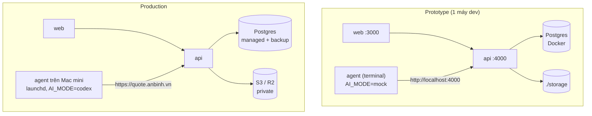

# 11 · Phạm vi prototype và đưa vào vận hành

## Mục đích

Tài liệu này trả lời **P1–P6**: prototype đã làm được gì, phần nào đang được giả lập, và từng phần sẽ được thay bằng triển khai thật như thế nào.

## Sơ đồ: prototype và production



## Phần giả lập và cách thay thế

| Phần giả lập | Trong prototype | Khi vận hành thật |
|---|---|---|
| **Mac mini** | Tiến trình agent chạy trên máy dev (đường dẫn dùng `path.join`, chạy được cả Windows lẫn macOS) | Chạy **cùng code** trên Mac mini: đặt `API_URL` trỏ tới server, cài như service launchd (file plist mẫu ở dưới). Không phải sửa code |
| **Codex CLI** | `AI_MODE=mock`, chuẩn hoá theo quy tắc | Cài Codex CLI trên Mac mini, đăng nhập, đặt `AI_MODE=codex`. Adapter đã gọi sẵn `codex exec` |
| **File storage** | Thư mục `./storage` | Viết class `S3Storage`, đặt `STORAGE_DRIVER=s3`. Key và DB giữ nguyên |
| **Hệ thống quản lý nội bộ** | Trang danh sách và chi tiết khách hàng tối giản, dữ liệu seed | Hệ thống của công ty đã có sẵn. Module báo giá được **gắn vào**: trang khách hàng hiện có thêm nút "Tạo báo giá" mở form của module, backend đọc khách hàng từ DB hoặc API của hệ thống đó |
| HTTPS, SSO, backup | HTTP localhost, đăng nhập đơn giản | Xem [09](09-security.md) |

### Ví dụ launchd (Doc only)

```xml
<!-- ~/Library/LaunchAgents/vn.anbinh.quote-agent.plist -->
<plist version="1.0"><dict>
  <key>Label</key><string>vn.anbinh.quote-agent</string>
  <key>ProgramArguments</key>
  <array><string>/usr/local/bin/node</string><string>/opt/quote-agent/dist/main.js</string></array>
  <key>EnvironmentVariables</key>
  <dict><key>API_URL</key><string>https://quote.anbinh.vn</string></dict>
  <key>RunAtLoad</key><true/>
  <key>KeepAlive</key><true/>
</dict></plist>
```

## Built và Doc only

| Built ✅ | Doc only 📄 |
|---|---|
| Đăng nhập (3 tài khoản seed), 2 vai trò | SSO, rate limit, HTTPS, IP allowlist |
| Khách hàng → chi tiết → form → xác nhận → gửi | Huỷ, Sửa báo giá, Tạo bản sao |
| Snapshot, backend tính tổng, idempotency key | Kiểm tra checksum sha256 |
| Agent pull + claim nguyên tử (`SKIP LOCKED`) | Lease, heartbeat, sweep job hết hạn |
| 4 trạng thái, auto-retry 3 lần, nút Thử lại, timeline | Backoff theo thời gian, trạng thái CANCELLED |
| Mock AI + adapter Codex, schema, timeout, fallback | Che PII, kiểm tra số, sandbox Codex, lưu lại kết quả AI, checkbox AI |
| Điền mẫu DOCX, kiểm tra placeholder, upload | Nhiều phiên bản mẫu, xuất PDF |
| Kiểm tra quyền sở hữu (kể cả tải file), API key agent | Log tải file |
| Cảnh báo Mac mini offline | launchd, FileVault, backup |

## Những thay đổi khi đưa vào production

1. Gắn module vào hệ thống quản lý nội bộ hiện có thay cho các trang khách hàng tối giản.
2. HTTPS, SSO, API key có xoay vòng và giới hạn IP.
3. Lease, heartbeat và sweep để tự phục hồi khi agent chết giữa chừng.
4. Storage S3/R2 private kèm signed URL, backup DB và storage.
5. Codex thật trong sandbox, kèm che PII và kiểm tra số.
6. Huỷ, sửa, tạo bản sao, nhiều phiên bản mẫu, xuất PDF.
7. Giám sát: cảnh báo (email/Slack) khi agent offline quá N phút hoặc có job FAILED.
